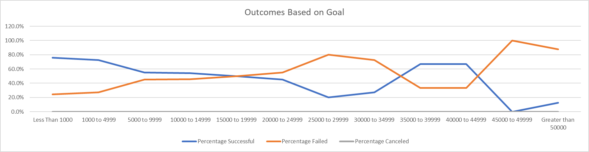
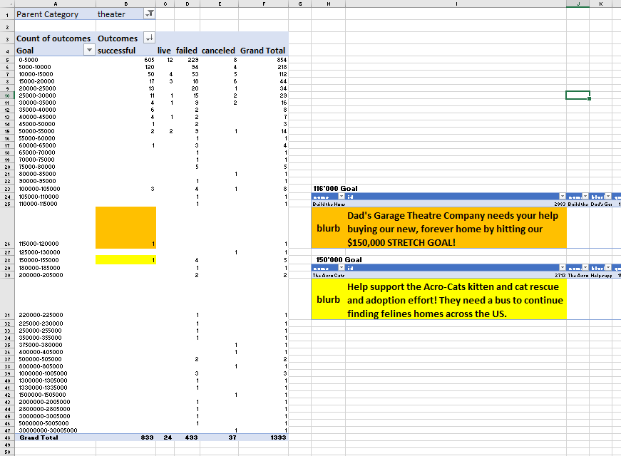

# Kickstarting with Excel

## Overview of Project

### Purpose
  The purpose of this analysis is to provide Louise with an analysis of previous Kickstarter campaigns so that she may be able to craft her campaign for success.
## Analysis and Challenges

### Analysis of Outcomes Based on Launch Date
  This analysis was performed by creating a Pivot Table from the raw data, filtering the data down to show us only Theater Category campaigns, and by counting the number of successful, failed and canceled outcomes to those campaigns.

  There were no real challenges during the performance of this analysis, but it should be noted that attention to detail is always key, especially when copying formulae.

### Analysis of Outcomes Based on Goals
  This analysis was performed by creating a table of new data by using formulae that referenced the raw data.  I used the COUNTIFS function, as well as simple division.  Formatting was also applied to make the percentages friendly to human eyes.

  There were no real challenges during the performance of this analysis, but it should be noted that the correct graph should be posted in the correct section of written analysis, lest your analysis be misunderstood.

### Challenges and Difficulties Encountered

## Results

- What are two conclusions you can draw about the Outcomes based on Launch Date?

  When considering all Theater Category launches, warm weather appears to align with the most launches of a successful campaign.  May, June and July had the highest numbers of successful campaigns, while April and August were pretty good, too.  
  
From September to March, there were less successful campaigns, although February was not bad.

- What can you conclude about the Outcomes based on Goals?

  When considering all Play Subcategory launches, it is clear that most Kickstarter campaigns are for small(ish) money.  Over 68% of all Play campaigns were for less than 5000 (720 of the 1047 total projects).  Those campaigns were successful a majority of the time - over 75% of campaigns for under 1000 were successful and a similar percentage (72.7%) of campaigns between 1000 and 4999 were successful.
  
  That being said, a majority of campaigns between 35K and 45K were successful, as well.  Once more than 45K was requested, the percentage of successfully funded campaigns went down drastically.

- What are some limitations of this dataset?

  One limitation of this dataset was the existence of different units of currency.  The current exchange rate between MXN and USD is 0.05 USD per 1 MXN.  This means that the amounts in the Goal and Pledged fields were not uniform.  Our analysis of Outcomes vs Goals was impacted by this limitation.  
  
  Another limitation of the anlaysis performed is that we looked at two different datasets for each of the above two analyses.  The first, Outcomes vs Launch, was performed on all Theater Category campaigns.  The second, Outcomes vs Goals, was performed on a subset of that data - Plays Subcategory only.

- What are some other possible tables and/or graphs that we could create?

  I have created an additional Pivot Table, in an attempt to analyze Goals vs Outcomes of all Theater campaigns.  It is not a 1-to-1 combination of our two analyses, as mentioned above in the 'Limitations' section.  However, it is an attempt to compare Goals vs Outcomes on Theater campaigns.  I have Grouped the rows into groups of 5'000 to more easily see what is going on in the data.
  
  We can see that the maximum successful Goal for a Theater campaigns was in the range of 150'000-155'000.  By clicking on that number (the 1 highlighted in yellow in the Pivot Table in the image below), we are able to see all of the data about that campaign.  It was called "The Acro Cats Mobile Foster and Kitty Tour Bus" and the blurb feild reads: "Help support the Acro-Cats kitten and cat rescue and adoption effort! They need a bus to continue finding felines homes across the US."  That does not sound like a Theater campaign to me - it sounds more like a charitable foundation for the adoption of pets.  It seems that this campaign has been mis-labeled.
 
 Therefore, I will go select the next-highest successful campaign, in the 115'000-120'000 range; again, I will click on that number (the 1 highlighted in orange in the Pivot Table in the image below) to see the details.  The campaign is named "Build the House of Dad's!" and the blurb reads: "Dad's Garage Theatre Company needs your help buying our new, forever home by hitting our $150,000 STRETCH GOAL!"  
 
  There we have it - a (real!) theater campaign, whose goal was 116'000 and was successful.  This was the campaign in our dataset for the Theater Category that had the maximum Goal.
  

